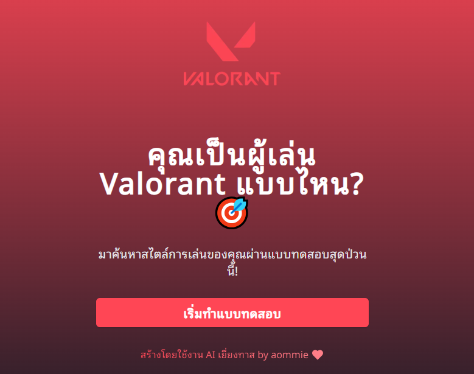

# Valorant Player Style Quiz



Welcome to the **Valorant Player Style Quiz**! This interactive quiz is designed to help you discover what type of Valorant player you are. Whether you're a Clutch God, Eco Master, or Team Player, this quiz will provide insights into your gameplay style.

## Features

- **Interactive Quiz**: Answer a series of fun questions to determine your player type.
- **Player Type Descriptions**: Get detailed descriptions of your player type along with an image representation.
- **Google Analytics Integration**: Track user interactions and page views for better insights.

## Technologies Used

- **Next.js**: A React framework for building server-rendered applications.
- **TypeScript**: A superset of JavaScript that adds static types.
- **Tailwind CSS**: A utility-first CSS framework for styling.
- **React GA**: Google Analytics integration for tracking user interactions.

## Getting Started

To get started with the project, follow these steps:

1. **Clone the repository**:
   ```bash
   git clone https://github.com/your-username/your-vlr-style.git
   cd your-vlr-style
   ```

2. **Install dependencies**:
   ```bash
   npm install
   ```

3. **Run the development server**:
   ```bash
   npm run dev
   ```

4. **Open your browser** and navigate to `http://localhost:3000` to view the application.

## Usage

- Start the quiz by clicking the "เริ่มทำแบบทดสอบ" (Start Quiz) button on the landing page.
- Answer the questions to find out your Valorant player type.
- Share your results with friends!


## Contributing

Contributions are welcome! If you have suggestions for improvements or new features, feel free to open an issue or submit a pull request.

## License

This project is licensed under the MIT License. See the [LICENSE](LICENSE) file for details.

## Acknowledgments

- Special thanks to the creators of the components and libraries used in this project.
- Inspired by the Valorant community and its diverse player styles.

---

Enjoy discovering your Valorant player style!
